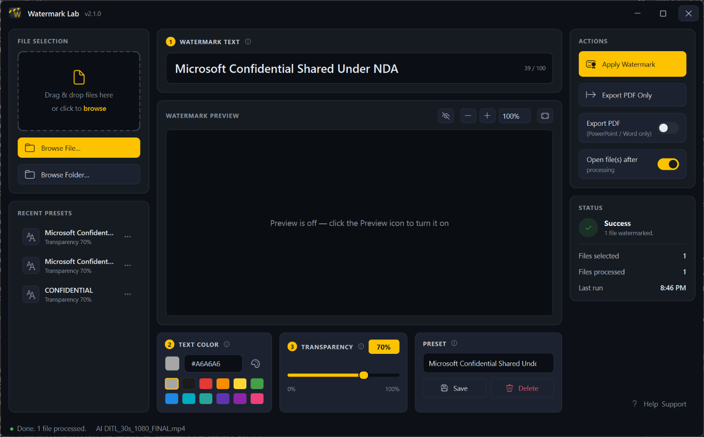

# Watermark Lab

> Add a clean, professional watermark to your PowerPoint, Word, PDF and video files — in seconds.

<p align="center">
  
</p>

---

## What's new in 2.1.0

- **A fresh, clearer interface** — you can always see what's happening: a job in progress, a green tick when it's done, or a friendly note if something needs a look.
- **A smoother preview** — sharper results, a quick heads-up while Word and PowerPoint previews are prepared, and zoom from 10% up to 800%.
- **Watermark PDFs too** — stamp every page of a PDF in the same style, with your original content showing through.

---

## What it does

Watermark Lab stamps text like **CONFIDENTIAL** diagonally across your documents and videos. Pick your words, choose a colour, set how see-through it should be, and you're done.

- Works with **PowerPoint, Word, PDF and video** files.
- Your documents stay **fully editable** — the watermark is added properly, not baked into a picture.
- Everything happens **on your own PC**. Nothing is uploaded — no account, no subscription.
- **See it before you save it** — a live preview shows exactly how the result will look as you type.
- **Nothing to install** — unzip the folder and double-click. Run it from your Desktop, a USB stick, anywhere.

---

## Features

- **Any text you like** — defaults to `CONFIDENTIAL`, up to 100 characters, and wraps automatically.
- **Your colour, your look** — choose from a palette, enter an exact colour, or pick one off your screen with the eyedropper.
- **Adjustable transparency** — slide it or type an exact amount, so the watermark never hides your content.
- **Live preview** — watch the real watermarked result update as you make changes.
- **Drag & drop** — drop a file straight onto the app, or browse for a single file or a whole folder.
- **Batch a folder** — watermark every supported file in one click.
- **Save your favourites** — store named presets (text + colour + transparency) and reuse them instantly.
- **Export to PDF** — optionally save a PDF alongside your watermarked PowerPoint or Word file, or just the PDF on its own.
- **Open when done** — the finished file can open automatically.
- **Clear status** — the app shows you when it's working, when it's finished, and tells you plainly if anything goes wrong.

---

## What you'll need

- A **Windows 10 or 11** PC.
- **Microsoft PowerPoint** — needed to watermark PowerPoint files.
- **Microsoft Word** — needed only for older `.doc` files and for exporting Word to PDF. Modern `.docx` files are watermarked without it.
- Not needed at all for **PDF or video** files.
- That's it — there's nothing else to install.

---

## Getting started

1. Download **`WatermarkLab.zip`** from the [latest release](https://github.com/brucemurphy/Watermark-Lab/releases/latest).
2. Extract it anywhere — your Desktop, a USB stick, wherever suits.
3. Double-click **`WatermarkLab.exe`**.

No installer. No admin rights. No setup.

---

## How to use it

1. **Add your file** — drag it onto the app, or click **Browse File…** (or **Browse Folder…** to do a whole batch). Works with PowerPoint, Word, PDF and video.
2. **Type your watermark text** — `CONFIDENTIAL` by default, but make it anything you want.
3. **Choose a colour and transparency** — use the palette, eyedropper, or type exact values.
4. **Check the preview** — it shows the real result. (For Word and PowerPoint, it takes a moment to render a sharp preview — the app lets you know.)
5. **Click Apply Watermark.** The status panel shows the job running, then a green tick when it's done — or a clear message if something needs your attention.

Your watermarked copy is saved right next to the original, with `_watermarked` added to the name — your original file is never changed:

```
my_presentation.pptx  →  my_presentation_watermarked.pptx
recording.mp4         →  recording_watermarked.mp4
```

When it's finished, click the folder icon in the status bar to jump straight to your new file.

---

## Watermarking videos

The first time you watermark a video, the app downloads a small video tool (about 30 MB) automatically — just click **Yes** when asked. After that it's instant, and it travels with the app if you copy the folder elsewhere.

---

## Staying up to date

Watermark Lab checks for new versions when it starts. If there's an update, it asks if you'd like to install it — click **Yes** and it updates itself and restarts. Your presets and recent files are always kept.

---

## A note on privacy

Watermark Lab runs entirely on your computer. Your files are never uploaded anywhere, and the app works completely offline (apart from the one-time video-tool download and checking for updates).

---

## License

Copyright © 2026 Bruce Murphy.
Released under the [MIT License](LICENSE).

---

## For developers

Curious how it works under the hood, or want to build from source? See **[TECHNICAL_DETAILS.md](TECHNICAL_DETAILS.md)** for the architecture, build instructions, project layout, and third-party licences.
